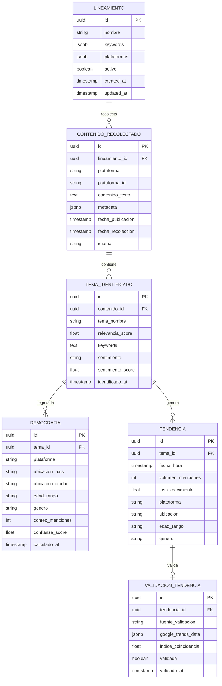

# Modelo de Datos: Sistema de Análisis de Tendencias en Redes Sociales

**Feature**: 001-social-trends-analysis
**Creado**: 2025-11-08
**Estado**: Fase 1 Diseño
**Base de Datos**: PostgreSQL 15+ con extensión TimescaleDB

---

## Diagrama Entidad-Relación



---

## Esquema de Base de Datos

### 1. lineamientos (Lineamientos)

**Propósito**: Configuración para los lineamientos de recolección de contenido

```sql
CREATE TABLE lineamientos (
    id UUID PRIMARY KEY DEFAULT gen_random_uuid(),
    nombre VARCHAR(255) NOT NULL,
    descripcion TEXT,

    -- Configuración de Recolección
    keywords JSONB NOT NULL,  -- ["keyword1", "keyword2", "hashtag1"]
    plataformas JSONB NOT NULL,  -- ["youtube", "reddit", "mastodon"]

    -- Estado
    activo BOOLEAN NOT NULL DEFAULT true,

    -- Auditoría
    created_at TIMESTAMPTZ NOT NULL DEFAULT NOW(),
    updated_at TIMESTAMPTZ NOT NULL DEFAULT NOW(),
    created_by VARCHAR(255),

    -- Restricciones
    CONSTRAINT lineamiento_nombre_unique UNIQUE (nombre),
    CONSTRAINT lineamiento_keywords_not_empty CHECK (jsonb_array_length(keywords) > 0),
    CONSTRAINT lineamiento_plataformas_not_empty CHECK (jsonb_array_length(plataformas) > 0)
);

-- Índices
CREATE INDEX idx_lineamientos_activo ON lineamientos (activo) WHERE activo = true;
CREATE INDEX idx_lineamientos_keywords ON lineamientos USING GIN (keywords);
```

**Reglas de Validación**:
- FR-001: `nombre` debe ser único
- FR-002: Al menos 1 palabra clave requerida
- FR-003: Al menos 1 plataforma seleccionada de ["youtube", "reddit", "mastodon"]

**Datos de Ejemplo**:
```json
{
  "id": "a1b2c3d4-e5f6-7890-abcd-ef1234567890",
  "nombre": "Tendencias Tecnología Colombia",
  "descripcion": "Análisis de tendencias tecnológicas en Colombia",
  "keywords": ["inteligencia artificial", "IA", "#TechColombia"],
  "plataformas": ["youtube", "reddit"],
  "activo": true,
  "created_at": "2025-11-08T10:00:00Z"
}
```

---

### 2. contenido_recolectado (Contenido Recolectado)

**Propósito**: Almacenar el contenido crudo recolectado de las plataformas de redes sociales

```sql
CREATE TABLE contenido_recolectado (
    id UUID PRIMARY KEY DEFAULT gen_random_uuid(),
    lineamiento_id UUID NOT NULL REFERENCES lineamientos(id) ON DELETE CASCADE,

    -- Datos de Plataforma
    plataforma VARCHAR(50) NOT NULL,  -- 'youtube', 'reddit', 'mastodon'
    plataforma_id VARCHAR(255) NOT NULL,  -- ID de contenido específico de la plataforma

    -- Contenido
    contenido_texto TEXT NOT NULL,
    titulo VARCHAR(500),
    autor VARCHAR(255),
    url TEXT,

    -- Métricas de Engagement
    metadata JSONB,  -- {likes, shares, comments, views, etc.}

    -- Marcas de Tiempo
    fecha_publicacion TIMESTAMPTZ NOT NULL,
    fecha_recoleccion TIMESTAMPTZ NOT NULL DEFAULT NOW(),

    -- Detección de Idioma
    idioma VARCHAR(10) DEFAULT 'es',  -- código ISO 639-1

    -- Estado de Procesamiento NLP
    nlp_procesado BOOLEAN DEFAULT false,
    nlp_procesado_at TIMESTAMPTZ,

    -- Restricciones
    CONSTRAINT contenido_plataforma_id_unique UNIQUE (plataforma, plataforma_id),
    CONSTRAINT contenido_plataforma_valid CHECK (plataforma IN ('youtube', 'reddit', 'mastodon')),
    CONSTRAINT contenido_texto_not_empty CHECK (length(contenido_texto) > 0)
);

-- Índices
CREATE INDEX idx_contenido_lineamiento ON contenido_recolectado (lineamiento_id);
CREATE INDEX idx_contenido_plataforma ON contenido_recolectado (plataforma);
CREATE INDEX idx_contenido_fecha_publicacion ON contenido_recolectado (fecha_publicacion DESC);
CREATE INDEX idx_contenido_fecha_recoleccion ON contenido_recolectado (fecha_recoleccion DESC);
CREATE INDEX idx_contenido_nlp_pending ON contenido_recolectado (nlp_procesado)
    WHERE nlp_procesado = false;

-- Índice de búsqueda de texto completo
CREATE INDEX idx_contenido_texto_search ON contenido_recolectado
    USING GIN (to_tsvector('spanish', contenido_texto));
```

**Reglas de Validación**:
- FR-004: Contenido único por plataforma (previene duplicados)
- FR-026: Idioma predeterminado 'es' para contenido en español
- FR-025: Retención de 7 días (manejado por trabajo de limpieza)

**Datos de Ejemplo**:
```json
{
  "id": "b2c3d4e5-f6a7-8901-bcde-f12345678901",
  "lineamiento_id": "a1b2c3d4-e5f6-7890-abcd-ef1234567890",
  "plataforma": "youtube",
  "plataforma_id": "dQw4w9WgXcQ",
  "contenido_texto": "La inteligencia artificial está revolucionando...",
  "titulo": "IA en Colombia 2025",
  "autor": "TechChannel",
  "url": "https://youtube.com/watch?v=dQw4w9WgXcQ",
  "metadata": {
    "views": 15000,
    "likes": 850,
    "comments": 42,
    "duration": "PT10M"
  },
  "fecha_publicacion": "2025-11-07T14:30:00Z",
  "fecha_recoleccion": "2025-11-08T10:15:00Z",
  "idioma": "es",
  "nlp_procesado": true
}
```

---

### 3. temas_identificados (Temas Identificados)

**Propósito**: Temas extraídos del contenido mediante NLP

```sql
CREATE TABLE temas_identificados (
    id UUID PRIMARY KEY DEFAULT gen_random_uuid(),
    contenido_id UUID NOT NULL REFERENCES contenido_recolectado(id) ON DELETE CASCADE,

    -- Información del Tema
    tema_nombre VARCHAR(255) NOT NULL,
    relevancia_score FLOAT NOT NULL CHECK (relevancia_score BETWEEN 0 AND 1),
    keywords TEXT[],  -- Array de palabras clave asociadas con el tema

    -- Análisis de Sentimiento
    sentimiento VARCHAR(20),  -- 'positive', 'negative', 'neutral'
    sentimiento_score FLOAT CHECK (sentimiento_score BETWEEN -1 AND 1),

    -- Entidades Nombradas
    entidades_mencionadas JSONB,  -- {persons: [], organizations: [], locations: []}

    -- Metadatos
    modelo_version VARCHAR(50),  -- Versión de BERTopic utilizada
    identificado_at TIMESTAMPTZ NOT NULL DEFAULT NOW(),

    -- Restricciones
    CONSTRAINT tema_sentimiento_valid CHECK (
        sentimiento IN ('positive', 'negative', 'neutral', 'mixed')
    )
);

-- Índices
CREATE INDEX idx_temas_contenido ON temas_identificados (contenido_id);
CREATE INDEX idx_temas_nombre ON temas_identificados (tema_nombre);
CREATE INDEX idx_temas_relevancia ON temas_identificados (relevancia_score DESC);
CREATE INDEX idx_temas_fecha ON temas_identificados (identificado_at DESC);
CREATE INDEX idx_temas_keywords ON temas_identificados USING GIN (keywords);
```

**Reglas de Validación**:
- FR-009: Temas extraídos mediante NLP (BERTopic)
- FR-010: Análisis de sentimiento por tema
- SC-002: 5-15 temas por cada 1,000 elementos de contenido

**Datos de Ejemplo**:
```json
{
  "id": "c3d4e5f6-a7b8-9012-cdef-123456789012",
  "contenido_id": "b2c3d4e5-f6a7-8901-bcde-f12345678901",
  "tema_nombre": "Inteligencia Artificial en Educación",
  "relevancia_score": 0.87,
  "keywords": ["IA", "educación", "aprendizaje", "estudiantes"],
  "sentimiento": "positive",
  "sentimiento_score": 0.65,
  "entidades_mencionadas": {
    "persons": ["Dr. García"],
    "organizations": ["Universidad Nacional"],
    "locations": ["Bogotá", "Colombia"]
  },
  "modelo_version": "BERTopic-0.16.0",
  "identificado_at": "2025-11-08T10:20:00Z"
}
```

---

### 4. demografia (Demografía por Tema)

**Propósito**: Segmentación demográfica de temas

```sql
CREATE TABLE demografia (
    id UUID PRIMARY KEY DEFAULT gen_random_uuid(),
    tema_id UUID NOT NULL REFERENCES temas_identificados(id) ON DELETE CASCADE,

    -- Jerarquía de 4 Niveles (FR-017)
    plataforma VARCHAR(50) NOT NULL,
    ubicacion_pais VARCHAR(100),
    ubicacion_ciudad VARCHAR(100),
    edad_rango VARCHAR(20),  -- '18-24', '25-34', '35-44', '45-54', '55+'
    genero VARCHAR(20),  -- 'male', 'female', 'other', 'unknown'

    -- Métricas
    conteo_menciones INT NOT NULL DEFAULT 1,
    confianza_score FLOAT CHECK (confianza_score BETWEEN 0 AND 1),

    -- Método de Inferencia
    metodo_inferencia VARCHAR(50),  -- 'direct', 'nlp', 'heuristic', 'ml_model'

    -- Metadatos
    calculado_at TIMESTAMPTZ NOT NULL DEFAULT NOW(),

    -- Restricciones
    CONSTRAINT demografia_plataforma_valid CHECK (
        plataforma IN ('youtube', 'reddit', 'mastodon')
    ),
    CONSTRAINT demografia_edad_valid CHECK (
        edad_rango IN ('18-24', '25-34', '35-44', '45-54', '55+', 'unknown')
    ),
    CONSTRAINT demografia_genero_valid CHECK (
        genero IN ('male', 'female', 'other', 'unknown')
    ),
    CONSTRAINT demografia_unique_segment UNIQUE (
        tema_id, plataforma, ubicacion_pais, ubicacion_ciudad,
        edad_rango, genero
    )
);

-- Índices
CREATE INDEX idx_demografia_tema ON demografia (tema_id);
CREATE INDEX idx_demografia_plataforma ON demografia (plataforma);
CREATE INDEX idx_demografia_ubicacion ON demografia (ubicacion_pais, ubicacion_ciudad);
CREATE INDEX idx_demografia_edad ON demografia (edad_rango);
CREATE INDEX idx_demografia_genero ON demografia (genero);
CREATE INDEX idx_demografia_confianza ON demografia (confianza_score DESC);

-- Índice compuesto para consultas jerárquicas (FR-017)
CREATE INDEX idx_demografia_hierarchy ON demografia (
    plataforma, ubicacion_pais, edad_rango, genero
);
```

**Reglas de Validación**:
- FR-011: Demografía inferida cuando no está disponible en la API
- FR-017: Jerarquía de 4 niveles (Plataforma → Ubicación → Edad → Género)
- SC-004: Precisión de inferencia ≥65%
- SC-005: Precisión de datos directos ≥95%

**Datos de Ejemplo**:
```json
{
  "id": "d4e5f6a7-b8c9-0123-def1-234567890123",
  "tema_id": "c3d4e5f6-a7b8-9012-cdef-123456789012",
  "plataforma": "youtube",
  "ubicacion_pais": "Colombia",
  "ubicacion_ciudad": "Bogotá",
  "edad_rango": "25-34",
  "genero": "female",
  "conteo_menciones": 145,
  "confianza_score": 0.72,
  "metodo_inferencia": "nlp",
  "calculado_at": "2025-11-08T10:25:00Z"
}
```

---

### 5. tendencias (Tendencias - Series Temporales)

**Propósito**: Datos de series temporales para temas en tendencia (hipertabla de TimescaleDB)

```sql
-- Crear extensión TimescaleDB
CREATE EXTENSION IF NOT EXISTS timescaledb;

CREATE TABLE tendencias (
    id UUID DEFAULT gen_random_uuid(),
    tema_id UUID NOT NULL REFERENCES temas_identificados(id) ON DELETE CASCADE,

    -- Series Temporales
    fecha_hora TIMESTAMPTZ NOT NULL,

    -- Métricas
    volumen_menciones INT NOT NULL DEFAULT 0,
    tasa_crecimiento FLOAT,  -- Tasa de crecimiento comparada con el período anterior

    -- Segmentación (para API jerárquica)
    plataforma VARCHAR(50) NOT NULL,
    ubicacion VARCHAR(100),
    edad_rango VARCHAR(20),
    genero VARCHAR(20),

    -- Estado de Tendencia
    es_tendencia BOOLEAN DEFAULT false,
    alerta_enviada BOOLEAN DEFAULT false,

    -- Restricciones
    CONSTRAINT tendencias_volumen_positive CHECK (volumen_menciones >= 0),
    PRIMARY KEY (fecha_hora, tema_id, plataforma, ubicacion, edad_rango, genero)
);

-- Convertir a hipertabla de TimescaleDB (fragmentos de 7 días según FR-025)
SELECT create_hypertable(
    'tendencias',
    'fecha_hora',
    chunk_time_interval => INTERVAL '7 days',
    if_not_exists => TRUE
);

-- Política de retención: 7 días (FR-025)
SELECT add_retention_policy(
    'tendencias',
    INTERVAL '7 days',
    if_not_exists => TRUE
);

-- Agregado continuo para tendencias por hora
CREATE MATERIALIZED VIEW tendencias_por_hora
WITH (timescaledb.continuous) AS
SELECT
    time_bucket('1 hour', fecha_hora) AS hora,
    tema_id,
    plataforma,
    ubicacion,
    edad_rango,
    genero,
    SUM(volumen_menciones) AS total_menciones,
    AVG(tasa_crecimiento) AS tasa_crecimiento_promedio,
    COUNT(*) AS num_registros
FROM tendencias
GROUP BY hora, tema_id, plataforma, ubicacion, edad_rango, genero;

-- Política de actualización para agregado continuo
SELECT add_continuous_aggregate_policy(
    'tendencias_por_hora',
    start_offset => INTERVAL '3 hours',
    end_offset => INTERVAL '1 hour',
    schedule_interval => INTERVAL '1 hour',
    if_not_exists => TRUE
);

-- Agregado continuo para tendencias diarias
CREATE MATERIALIZED VIEW tendencias_por_dia
WITH (timescaledb.continuous) AS
SELECT
    time_bucket('1 day', fecha_hora) AS dia,
    tema_id,
    plataforma,
    ubicacion,
    SUM(volumen_menciones) AS total_menciones,
    AVG(tasa_crecimiento) AS tasa_crecimiento_promedio,
    MAX(tasa_crecimiento) AS tasa_crecimiento_max
FROM tendencias
GROUP BY dia, tema_id, plataforma, ubicacion;

-- Índices
CREATE INDEX idx_tendencias_tema ON tendencias (tema_id, fecha_hora DESC);
CREATE INDEX idx_tendencias_plataforma ON tendencias (plataforma, fecha_hora DESC);
CREATE INDEX idx_tendencias_es_tendencia ON tendencias (es_tendencia, fecha_hora DESC)
    WHERE es_tendencia = true;
CREATE INDEX idx_tendencias_alerta_pendiente ON tendencias (alerta_enviada, fecha_hora DESC)
    WHERE es_tendencia = true AND alerta_enviada = false;
```

**Reglas de Validación**:
- FR-016: Instantáneas horarias de métricas de tendencias
- FR-025: Retención de 7 días (automatizada mediante política de TimescaleDB)
- FR-027: Alerta cuando el crecimiento >50% en 24h
- SC-003: Respuesta de consulta <3s para 100k elementos

**Datos de Ejemplo**:
```json
{
  "id": "e5f6a7b8-c9d0-1234-ef12-345678901234",
  "tema_id": "c3d4e5f6-a7b8-9012-cdef-123456789012",
  "fecha_hora": "2025-11-08T10:00:00Z",
  "volumen_menciones": 145,
  "tasa_crecimiento": 0.62,
  "plataforma": "youtube",
  "ubicacion": "Colombia",
  "edad_rango": "25-34",
  "genero": "female",
  "es_tendencia": true,
  "alerta_enviada": false
}
```

---

### 6. validacion_tendencias (Validación de Tendencias)

**Propósito**: Validar tendencias detectadas con fuentes externas (Google Trends)

```sql
CREATE TABLE validacion_tendencias (
    id UUID PRIMARY KEY DEFAULT gen_random_uuid(),
    tendencia_id UUID REFERENCES tendencias(id) ON DELETE SET NULL,
    tema_nombre VARCHAR(255) NOT NULL,

    -- Fuente de Validación
    fuente_validacion VARCHAR(50) NOT NULL DEFAULT 'google_trends',

    -- Datos de Google Trends
    google_trends_data JSONB,  -- Respuesta cruda de Google Trends

    -- Resultados de Validación
    indice_coincidencia FLOAT CHECK (indice_coincidencia BETWEEN 0 AND 1),
    validada BOOLEAN NOT NULL,

    -- Análisis de Brechas (FR-022)
    en_google_trends BOOLEAN,
    solo_en_plataforma BOOLEAN,

    -- Metadatos
    validado_at TIMESTAMPTZ NOT NULL DEFAULT NOW(),

    -- Restricciones
    CONSTRAINT validacion_fuente_valid CHECK (
        fuente_validacion IN ('google_trends', 'manual', 'other')
    )
);

-- Índices
CREATE INDEX idx_validacion_tendencia ON validacion_tendencias (tendencia_id);
CREATE INDEX idx_validacion_validada ON validacion_tendencias (validada);
CREATE INDEX idx_validacion_fecha ON validacion_tendencias (validado_at DESC);
CREATE INDEX idx_validacion_gap ON validacion_tendencias (solo_en_plataforma)
    WHERE solo_en_plataforma = true;
```

**Reglas de Validación**:
- FR-021: Validación cruzada con Google Trends
- FR-022: Identificar tendencias solo en datos de plataforma (análisis de brechas)
- SC-007: El análisis de brechas identifica 5+ tendencias exclusivas por semana

**Datos de Ejemplo**:
```json
{
  "id": "f6a7b8c9-d0e1-2345-f123-456789012345",
  "tendencia_id": "e5f6a7b8-c9d0-1234-ef12-345678901234",
  "tema_nombre": "Inteligencia Artificial en Educación",
  "fuente_validacion": "google_trends",
  "google_trends_data": {
    "interest_over_time": [
      {"date": "2025-11-01", "value": 45},
      {"date": "2025-11-08", "value": 72}
    ],
    "related_queries": ["IA educación", "machine learning escuelas"]
  },
  "indice_coincidencia": 0.85,
  "validada": true,
  "en_google_trends": true,
  "solo_en_plataforma": false,
  "validado_at": "2025-11-08T11:00:00Z"
}
```

---

## Resumen de Relaciones

### Relaciones Uno-a-Muchos

1. **Lineamiento → Contenido Recolectado** (1:N)
   - Un lineamiento recolecta muchos elementos de contenido
   - Eliminación en cascada: Eliminar un lineamiento remueve todo el contenido recolectado

2. **Contenido Recolectado → Temas Identificados** (1:N)
   - Un elemento de contenido puede contener múltiples temas
   - Eliminación en cascada: Eliminar contenido remueve los temas identificados

3. **Tema Identificado → Demografía** (1:N)
   - Un tema tiene múltiples segmentos demográficos
   - Eliminación en cascada: Eliminar un tema remueve la demografía

4. **Tema Identificado → Tendencias** (1:N)
   - Un tema genera datos de tendencias en series temporales
   - Eliminación en cascada: Eliminar un tema remueve el historial de tendencias

### Relaciones Uno-a-Uno

5. **Tendencia → Validación Tendencia** (1:0..1)
   - Una tendencia puede tener cero o una validación
   - Establecer nulo al eliminar: Eliminar una tendencia mantiene la validación para auditoría

---

## Estrategia de Retención de Datos (FR-025)

### Limpieza Automatizada (retención de 7 días)

```sql
-- Retención automática de TimescaleDB (ya configurada arriba)
-- Limpieza manual para tablas no-TimescaleDB

CREATE OR REPLACE FUNCTION cleanup_old_data()
RETURNS void AS $$
BEGIN
    -- Eliminar contenido con más de 7 días
    DELETE FROM contenido_recolectado
    WHERE fecha_recoleccion < NOW() - INTERVAL '7 days';

    -- Eliminar temas huérfanos (ya no referenciados)
    DELETE FROM temas_identificados
    WHERE contenido_id NOT IN (SELECT id FROM contenido_recolectado);

    -- Eliminar demografía huérfana
    DELETE FROM demografia
    WHERE tema_id NOT IN (SELECT id FROM temas_identificados);

    -- Eliminar validaciones huérfanas
    DELETE FROM validacion_tendencias
    WHERE tendencia_id IS NULL AND validado_at < NOW() - INTERVAL '7 days';

    RAISE NOTICE 'Old data cleanup completed';
END;
$$ LANGUAGE plpgsql;
```

### Limpieza Programada (tarea Celery)

```python
# backend/src/tasks/maintenance.py
@app.task
def cleanup_old_data():
    """Run daily at 3 AM (per beat schedule)"""
    with connection.cursor() as cursor:
        cursor.execute("SELECT cleanup_old_data();")
```

---

## Optimización de Rendimiento

### Patrones de Consulta para Respuesta <3s (SC-003)

**Consulta API Jerárquica** (FR-017):
```sql
-- Consulta optimizada usando índices y agregados continuos
SELECT
    plataforma,
    ubicacion_pais AS ubicacion,
    edad_rango,
    genero,
    COUNT(DISTINCT tema_id) AS num_temas,
    SUM(conteo_menciones) AS total_menciones
FROM demografia
WHERE calculado_at >= NOW() - INTERVAL '24 hours'
    AND confianza_score >= 0.65  -- Filtrar baja confianza
GROUP BY plataforma, ubicacion_pais, edad_rango, genero
ORDER BY total_menciones DESC
LIMIT 100;
```

**Consulta de Detección de Tendencias** (FR-027):
```sql
-- Usar agregado continuo para rendimiento
SELECT
    t.tema_id,
    ti.tema_nombre,
    t.plataforma,
    t.volumen_menciones AS menciones_actuales,
    LAG(t.volumen_menciones, 1) OVER (
        PARTITION BY t.tema_id
        ORDER BY t.fecha_hora
    ) AS menciones_anteriores,
    t.tasa_crecimiento
FROM tendencias_por_hora t
JOIN temas_identificados ti ON t.tema_id = ti.id
WHERE t.hora >= NOW() - INTERVAL '24 hours'
    AND t.tasa_crecimiento > 0.50  -- FR-027: >50% crecimiento
    AND t.es_tendencia = false  -- Aún no marcado
ORDER BY t.tasa_crecimiento DESC;
```

### Configuración de Base de Datos

```sql
-- Configuración de TimescaleDB para rendimiento
ALTER DATABASE trendsgpx SET timescaledb.max_background_workers = 8;
ALTER DATABASE trendsgpx SET shared_preload_libraries = 'timescaledb';

-- Ajuste de PostgreSQL
ALTER SYSTEM SET shared_buffers = '2GB';
ALTER SYSTEM SET effective_cache_size = '6GB';
ALTER SYSTEM SET maintenance_work_mem = '512MB';
ALTER SYSTEM SET checkpoint_completion_target = 0.9;
ALTER SYSTEM SET wal_buffers = '16MB';
ALTER SYSTEM SET default_statistics_target = 100;
ALTER SYSTEM SET random_page_cost = 1.1;  -- SSD
```

---

## Estrategia de Migración

### Migraciones Alembic

```python
# alembic/versions/001_initial_schema.py
"""Initial schema

Revision ID: 001
Create Date: 2025-11-08
"""

def upgrade():
    # Enable extensions
    op.execute("CREATE EXTENSION IF NOT EXISTS timescaledb;")
    op.execute("CREATE EXTENSION IF NOT EXISTS pg_trgm;")

    # Create tables in dependency order
    # 1. lineamientos
    # 2. contenido_recolectado
    # 3. temas_identificados
    # 4. demografia
    # 5. tendencias (convert to hypertable)
    # 6. validacion_tendencias

    # Create continuous aggregates
    # Create indexes
    # Set up retention policies

def downgrade():
    # Drop in reverse order
    pass
```

---

## Matriz de Validación

| Requisito | Implementación | Tabla/Columna |
|-------------|----------------|--------------|
| FR-001 | Nombres de lineamiento únicos | `lineamientos.nombre UNIQUE` |
| FR-004 | No contenido duplicado | `contenido_recolectado(plataforma, plataforma_id) UNIQUE` |
| FR-009 | Extracción de temas por NLP | `temas_identificados` con metadatos de BERTopic |
| FR-011 | Inferencia demográfica | `demografia.metodo_inferencia` rastrea el método |
| FR-016 | Instantáneas horarias | `tendencias` con agregados horarios de TimescaleDB |
| FR-017 | Jerarquía de 4 niveles | Índice de `demografia` en (plataforma, ubicacion, edad, genero) |
| FR-021 | Validación con Google Trends | `validacion_tendencias.google_trends_data` |
| FR-025 | Retención de 7 días | Política de retención de TimescaleDB + función de limpieza |
| FR-027 | Alerta de crecimiento >50% | Consulta `tendencias.tasa_crecimiento > 0.5` |
| SC-003 | Respuesta de consulta <3s | Agregados continuos de TimescaleDB + índices |
| SC-004 | Precisión de inferencia del 65% | Filtro `demografia.confianza_score >= 0.65` |

---

## Próximos Pasos

1. ✅ Esquema definido y validado
2. 🔄 Crear migraciones Alembic (Fase 2)
3. 🔄 Implementar modelos SQLAlchemy (Fase 2)
4. 🔄 Agregar scripts de inicialización de base de datos (Fase 2)
5. 🔄 Pruebas de rendimiento con 100k registros (Fase 2)

**Estado**: ✅ Diseño del modelo de datos completo
